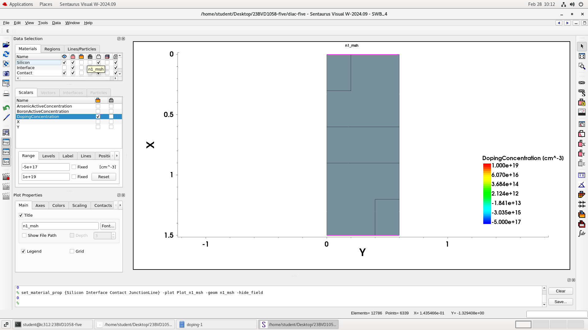

# DIAC Device Modelling Using Synopsys Sentaurus TCAD

This repository contains a TCAD-based study of a multi-layer DIAC device simulated using Synopsys Sentaurus. 
The project analyzes breakdown behavior and scaling effects across micrometer and nanometer scale.

  

  
   
  <em>Five-layer DIAC structure with boron and arsenic doping (µm scale)</em>

## Toolchain
- Sentaurus Structure Editor (SDE)
- Sentaurus Device (SDEVICE)
- Sentaurus Visual (SVisual)

## Device Overview
- Five-layer DIAC structure
- Boron- and arsenic-doped regions
- Anode and cathode contacts
- Junction-focused meshing

## Analysis Performed
- I–V characteristics
- Electric field
- Electrostatic potential
- Space charge
- Electron and hole mobility
- Carrier density
- Band diagram

